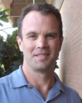

.. _personal:

================
 Sergio J. Rey
================

It all started when I was born in Long Branch, `New Jersey
<http://sphotos.xx.fbcdn.net/hphotos-ash2/21939_1124828819695_1796387758_255780_6249858_n.jpg>`_. I spent most
of my childhood surfing [*]_ in `Sea Girt
<http://www.google.com/url?sa=t&rct=j&q=&esrc=s&source=web&cd=3&ved=0CEAQFjAC&url=http%3A%2F%2Fen.wikipedia.org%2Fwiki%2FSea_Girt%2C_New_Jersey&ei=RIxzT62WGISe2gWNpMHcDg&usg=AFQjCNFZeGHbBiXqmp7J5ryH7s6cPiQMcA&sig2=e4IgUaaRTN3qWUd8CW8B5w>`_
during the fall-winter-spring, and
summers meant trekking across the US with my parents, three younger
brothers, one younger sister and a pack of dogs. We all still love each
other despite these experiences.

The traveling planted the geographic bug in me and after obtaining my
undergraduate degree in Environmental Science from Stockton College
(Pomona, N.J.) I moved to the left coast where I obtained my PhD in
geography at UC Santa Barbara.

In 1992 I joined the faculty of the Department of Geography at San Diego
State University where I spent 16 great years, the last one as
chair. In 2008 I moved to what was then the School of Geographical
Sciences, and is now the School of Geographical Sciences and Urban
Planning, at Arizona State University.

Outside of my academic interests, I am a geek at heart, but this is
hopefully somewhat balanced by a love of `road cycling <_static/cycling.jpg>`_. As such any free
time I am not spending with my wonderful family usually finds my hands
either on a keyboard or on the tops/drops/hoods.

Trivia
------

 - I have been to all but 2 of the United States. Don't ask how I missed Alaska and
   Montana - they are on the bucket list.
 - I am a die-hard Allman Brothers Band fan. Lost count of how many shows
   I've seen. I have actually met Gregory Allman and had the chance to
   drive his wife to the laundry mat on one occasion.
 - My "evil first wife" [*]_ is a famous `professor <http://geoplan.asu.edu/franklin>`_.
 - I am a NY Giants and NY Yankees fan. You see, growing up on The Shore
   (exit 98), it was either Mets+Jets or Gmen+Bombers. I have class and
   good taste, so I went with the latter.
 - One of my brothers is a famous `professor
   <http://www.cla.temple.edu/religion/faculty/terry-rey/>`_.
 - My friends call me Serge. Only my mother (when upset) and the police
   call me Sergio.
 - I created `The Linux Install Podcast: TheLIP <http://thelip.net>`_ and was
   co-founder and host of the `Going Linux Podcast
   <http://goinglinux.com>`_. [*]_

**Footnotes**

.. [*] Goofey foot.

.. [*] As she often reminds me: "Every man who has been married has an evil first wife, some of you are just still married to them." I'm lucky to be one of these guys - we have been married since 1988.

.. [*] The LIP is now defunct, sadly, but Going Linux is going strong at episode 167 as of 2012-03-28.

.. include:: contact.txt

.. include:: links.txt
